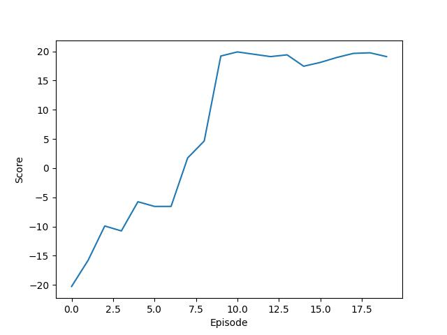

# Playing Atari Games With Deep Q-Network

This project uses various of reinforcement learning techniques to learn playing atari games. The techniques include
- Deep Q-Network.
- Double learning.
- Prioritized buffer replay.

## Example
One epoch is equal to 100,000 steps.

| task               | best reward | test reward curve                               | parameter                                                |
| ------------------ | ----------- | ----------------------------------------------- | -------------------------------------------------------- |
| PongNoFrameskip-v4 | 20          |  | `python DDQN.py --task PongNoFrameskip-v4 --n_epochs 20` | 

